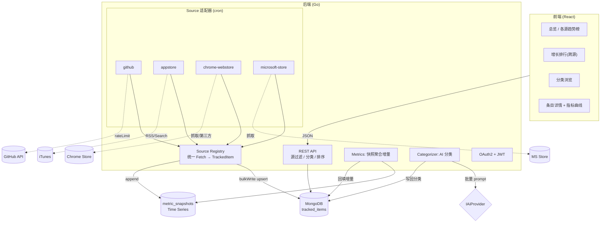

# Project Context — GHTA (Trend Aggregation Platform)

## 项目定位

**多源开发者/软件生态趋势聚合平台**。统一抓取多个来源的排行与趋势数据——GitHub 仓库、
Apple App Store 应用、Chrome Web Store 扩展、Microsoft Store 软件——为每个条目积累指标历史时间序列，
用 AI 统一归类，并通过 Web 前端与 REST API 对外提供跨源趋势洞察。
目标形态：开发者/产品情报站（趋势榜/增长排行/分类浏览/周报/付费 API），
对标 chrome-stats.com 但覆盖多平台。GitHub 是首个也是已落地的数据源。

## 架构决策（Decisions）

本节记录已拍板的方向性决策，作为所有 change 的既定前提。

| 决策 | 结论 | 依据 |
|------|------|------|
| 后端语言 | **NestJS/TS → Go 重写** | 负载 IO 密集（多源抓取/Mongo/cron/REST），Go 甜区；单二进制部署。团队/产品选型决策。 |
| 数据库 | **保留 MongoDB** | 文档型数据 + 简单查询 + 原生 Time Series 快照。多源统一模型天然适合文档库。 |
| 数据模型 | **通用 TrackedItem + Source 适配器** | 各源共享快照/趋势/分类/排行，仅抓取适配器与少数源专属字段不同。通用模型直接建进 Go 重写，GitHub 为第一个适配器。 |
| 多源扩展 | **App Store → Chrome → MS Store，各一 change** | 按数据获取可行性排序：App Store 有官方渠道，另两者需抓取/第三方。 |
| 分析/搜索扩展 | **需要时加旁路，不换主库** | 重聚合 → ClickHouse 同步；全文/语义搜索 → Meilisearch 或 embedding。均旁路，Mongo 作 operational store。 |
| 前端 | **新建 TS + React，源维度感知** | 专业数据看板；源切换/过滤为一等维度，随每个源 change 扩展前端。 |
| 前端 UI | **专业产品设计 + 设计系统** | 设计令牌、信息架构、响应式、可访问性、数据可视化统一规范。 |

## 数据获取可行性（各源现实）

代码不是难点，**拿到数据**才是。各源通道与风险差异极大：

| 源 | 数据通道 | 难度 / 风险 |
|---|---|---|
| GitHub | GraphQL API（官方、干净） | ✅ 已实现 |
| Apple App Store | iTunes RSS 榜单 feed + iTunes Search API（官方、免费、有 Top Charts） | 🟡 中：官方渠道，字段有限、有配额、按国家/品类分榜 |
| Chrome Web Store | 无官方 API；chrome-stats.com 付费第三方；自行抓页面 | 🔴 高：反爬 + ToS/法律考量，需先评估合规 |
| Microsoft Store | 无公开排行 API；需抓取或非官方接口 | 🔴 高：同上，榜单入口零散 |

> 每个源 change 的 design.md SHALL 记录其数据通道选择、合规边界与失败降级策略。

## 功能列表

| # | 功能 | 归属 | 状态 |
|---|------|------|------|
| 1 | 通用 TrackedItem + Source 适配器模型 | backend | ❌ 随 Go 重写新建 |
| 2 | GitHub 源：GraphQL 抓取 + 持久化 | backend(source) | ✅ 已有(NestJS)，随重写重建为适配器 |
| 3 | 通用趋势查询 API（源过滤、指标区间、分类、排序） | backend | ✅ GitHub 版已有(含 bug)，重建时泛化 |
| 4 | 指标历史快照 + 增长排行（跨源） | backend | ❌ 未实现（核心价值） |
| 5 | AI 统一分类（跨源条目） | backend | ✅ GitHub 版已有(含缺陷)，重建 + 批量化 |
| 6 | 分类管理 CRUD + 分类树 | backend | ✅ 已有 |
| 7 | Google OAuth 认证 + 接口守卫 | backend | ❌ 仅配置，未实现 |
| 8 | App Store 源适配器 | backend(source) | ❌ 未实现 |
| 9 | Chrome Web Store 源适配器 | backend(source) | ❌ 未实现 |
| 10 | Microsoft Store 源适配器 | backend(source) | ❌ 未实现 |
| 11 | Web 前端 + 专业 UI（源维度感知） | frontend | ❌ 未实现（新建） |
| 12 | 用户管理 | backend | ⚠️ 模板，随 auth 收敛 |

## 目标技术架构

### 技术栈

**后端 (Go)**: Go 1.22+；HTTP Gin；OpenAPI swaggo；Mongo 官方 driver；cron robfig；
校验 validator；AI openai-go（OpenAI/LM Studio/DeepSeek，Provider 模式）；日志 slog；
认证 golang-jwt + x/oauth2。

**前端 (TS+React)**: Vite + React 18；TanStack Query；shadcn/ui + Tailwind + 设计令牌；
图表遵循 dataviz 规范；React Router。

**数据库**: MongoDB 8（不变），通用条目集合 + Time Series 指标快照集合。

### 通用数据流

### 数据模型（Mongo）

- **TrackedItem**（通用主文档）: `source`(github/appstore/chrome/msstore)、`externalId`（源内唯一，如 owner/name 或 appId）、
  name、description、category[]、categoryPath、primaryMetric、`metrics{}`（源相关：star/download/rating/rankPosition…）、
  增量字段（daily/weekly/monthly）、analysisStatus、fetchedAt。`(source, externalId)` 复合唯一索引。
- **MetricSnapshot**（新，Time Series）: meta=(source, externalId)、capturedAt、metrics{}。
- **Category / User / FetchRun**: 同前。

> GitHub 的 repoNameID/starCount 等映射为 TrackedItem 的 externalId/metrics.stars；
> 源专属字段（如 releases、README）可存 TrackedItem 的 `sourceData` 子文档，不污染通用层。

## 已知问题（Go 重写要"建对"的清单）

**P0 设计缺失**: 无历史快照（覆盖更新丢失趋势）→ 快照模型内建。

**P1 正确性**（rewrite change 内建规避）: categoryPath 静默丢弃；`$size:0` 漏存量文档；
Category 根分类 parentId 矛盾；issues 参数类型不一致致 500 且 0 边界误拒；sort 字段名不符无白名单；
限流计数器不复位永久拒绝；`logger.log(process.env)` 泄密；user update 传对象当 id；AI 解析强依赖围栏。

**P2 效率**（rewrite change 内建）: 逐条 findOne+create/update 无索引；单体 for 循环无断点续跑；
AI 逐条无失败标记；手写限流与真实配额脱节；死代码/未用依赖。

**P3 缺失能力**: 无认证（写接口全公开）；无前端；仅单源。

## 开发路线（changes 执行顺序）

1. `1-rewrite-backend-golang` — Go 重写 + **通用 TrackedItem/Source 模型** + GitHub 适配器 + 全部 P1/P2 正确性效率 + 配置/日志卫生（保留 Mongo）
2. `2-add-star-history` — 通用指标快照 + 增量计算 + 跨源增长排行（GitHub 为首批数据）
3. `3-improve-ai-categorization` — 结构化输出 + 批量分类 + 失败标记（跨源）
4. `4-add-authentication` — Google OAuth + JWT + 接口守卫
5. `5-add-frontend-react` — React 前端 + 专业 UI（源维度感知；随各源 change 扩展）
6. `6-add-source-appstore` — Apple App Store 适配器（iTunes RSS/Search）
7. `7-add-source-chrome-webstore` — Chrome Web Store 适配器（抓取/第三方，含合规评估）
8. `8-add-source-microsoft-store` — Microsoft Store 适配器（抓取，含合规评估）

> 源 change（6/7/8）各自实现一个 Source 适配器并复用通用快照/趋势/分类/排行能力；每个源 change 同时在前端补该源的展示。specs/ 现状规格描述与语言无关的行为，作为 Go 重写的验收基线。

## 约定

- 后端 Go：handler/service/repository/job/adapter 分层；Source 适配器实现统一 `Fetcher` 接口注册进 registry；AI 用 Provider 模式。
- 前端 React：设计令牌驱动、组件化、TanStack Query 管服务端状态、图表遵循 dataviz 规范；源为一等过滤维度。
- Schema：`(source, externalId)` 唯一索引；查询字段建索引；写批量用 bulkWrite。
- 日志结构化（slog），禁止打印敏感信息。
- 提交信息英文祈使句；spec/文档用中文。
- spec 描述行为（与实现语言无关）；change 的 spec delta 用 ADDED/MODIFIED Requirements。
